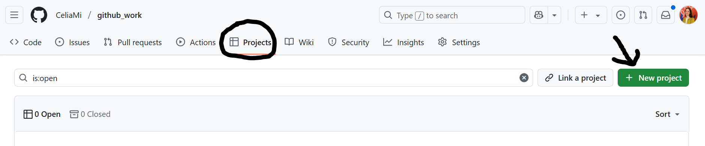
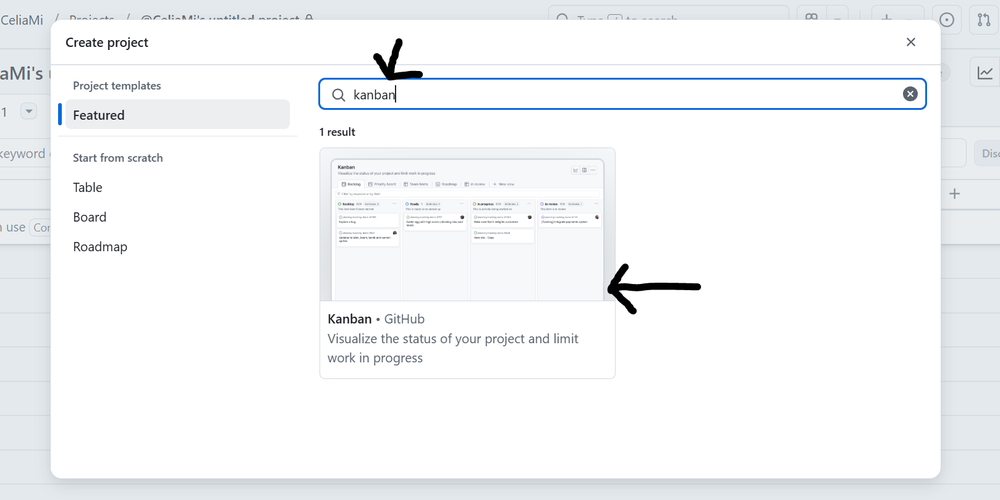
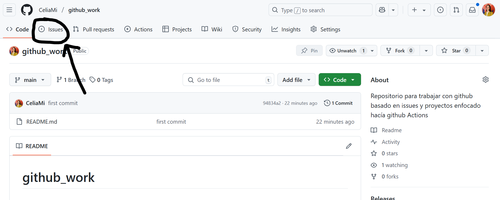
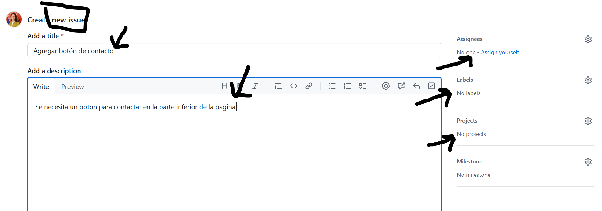
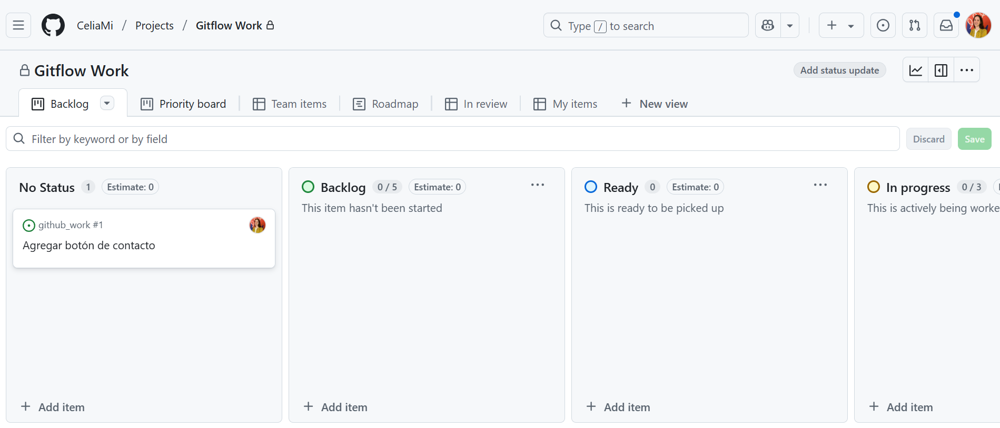
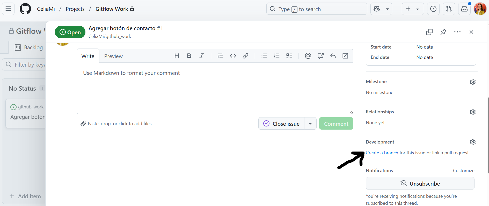

# github_work

Paso a Paso: Repositorio + Project + Issues + Templates 

1️⃣ Crear el repositorio en GitHub

Entra en tu perfil de github
Haz clic en el botón verde `"New repository"`.


2️⃣ Crear un proyecto (Projects)
En tu repositorio, ve a la pestaña "Projects".



Crea un nuevo proyecto, estilo kanban


Si fuera un proyecto muy grande estaría bien nombrar cada `project` como Sprint 1, Sprint 2 y que cada repo tendría tantos `project` como sprints.

Pero en este caso nuestro proyecto es pequeño y no tiene sentido crear un `project` por sprint. Asique vamos a darle el nombre general de nuestro proyecto.

Ejemplo:

- 📁Repo: mi-aplicacion
- `Project` (Kanban): Mi Aplicación

Ahora verás que se ha generado un tablero con columnas del tipo: "To do", "In progress" y "Done".

Vamos a dejar esto apartado por un momento y vamos a crear un issue básico que luego gestionaremos dentro de este project.

3️⃣ Crear un issue básico (sin template)

En el repo, ve a la pestaña "Issues".


Haz clic en "New issue".


Escribe un título, por ejemplo: `Agregar botón de contacto`

Pon una breve descripción de la tarea: `Se necesita un botón para contactar en la parte inferior de la página.`

Ahora sin salir del issue fijate en el margen derecho de tu pantalla:

Asignala a quién tenga que hacer esa tarea ( puedes ser tu).

En la sección "Projects", vinculalo al Project que creaste antes.

Clic en "Submit new issue".

Bien, si ahora volvemos a nuestra pestaña de proyectos, veremos que el issue que creamos aparece en la columna "No status"✨



Si pulsamos sobre el nuevo issue, podemos ver que se ha vinculado correctamente al proyecto. Ahora vamos a crear nuestra rama de trabajo asociado a esta tarea.


Cada vez que hagas commit acuerdate de agregar el número del issue al que corresponde. Por ejemplo:

```bash
git commit -m "feat: agregar botón de contacto (#1)"
``` 
Así quedará registrado en el commit que este commit está relacionado con el issue #1.
Esto es muy útil para que luego al hacer un Pull Request puedas cerrar el issue automáticamente.


4️⃣ Crear templates para issues

Dentro del repositorio, ve a la pestaña "Code".

Crea una carpeta llamada .github/ISSUE_TEMPLATE/.

Dentro de esa carpeta, crea un archivo por cada tipo de issue que quieras. Por ejemplo:

Archivo: .github/ISSUE_TEMPLATE/feature_request.yml

```yml
name: "Feature Request"
description: "Sugiere una nueva funcionalidad"
title: "[FEATURE] "
labels: ["enhancement"]
assignees: []

body:
  - type: markdown
    attributes:
      value: |
        ## Solicitud de funcionalidad
        Por favor completá los siguientes campos para describir la nueva funcionalidad.

  - type: textarea
    id: descripcion
    attributes:
      label: "📄 Descripción"
      description: "¿Qué se quiere implementar?"
      placeholder: "Ej: Un buscador en la parte superior del sitio"
    validations:
      required: true

  - type: textarea
    id: comentarios_adicionales
    attributes:
      label: "📝 Comentarios adicionales"
      description: "¿Consideraciones técnicas, referencias, links, etc.?"
      placeholder: "Ej: Requiere usar una API externa, diseño según figma.com/proyecto..."
    validations:
      required: false

````
También puedes crear uno desde la interfaz web: ve a Settings > Issues > Set up templates.

4️⃣ Crear issues desde templates
Ve a la pestaña "Issues" > "New issue".

Verás los templates que creaste (ej. "Feature Request").

Elige uno, completa los campos y crea el issue.

Asocia el issue al proyecto (usa la barra lateral derecha).

5️⃣ Crear un Pull Request desde el issue
Ve a la pestaña "Issues".
Verás un botón para crear un Pull Request.

En el cuerpo del PR, escribe Closes #7 → esto cerrará el issue automáticamente al hacer merge.

Envía el PR y espera aprobación.

